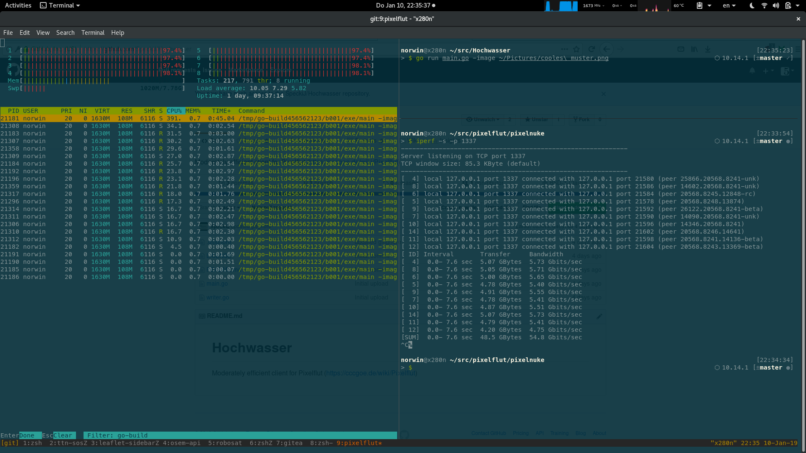

<h1 align="center" >🌊🌊🌊 Hochwasser 🌊🤽🌊</h1>
<p align="center"></p>

Highly efficient client for [Pixelflut]:
Faster than [sturmflut]! (In some benchmarks at least)

Can currently only send a single picture though.

[pixelflut]: https://cccgoe.de/wiki/Pixelflut
[sturmflut]: https://github.com/TobleMiner/sturmflut

## benchmark
The following benchmark was run on a max-spec X280 against version [d4c574b].

I could not figure out what the performance bottleneck is, but it doesn't seem
to be CPU limited, as turbo-boost doesn't kick in.

To reproduce, run the following commands in separate shells:

```sh
iperf -s -p 1337
go run main.go -image benchmark/test.png -connection 10
```



55 Gbps on average! 🌊🌊🌊

[sturmflut] (`./sturmflut 127.0.0.1:1337 benchmark/test.png -t 10`, version `8ec6ee9`) managed to get 48 Gpbs throughput on this system.

> Hint: Benchmarking throughput against the [pixelnuke][pixelflut_gh] server is
  pointless, as performance is then CPU-limited to ~1 Gbps by the server.
  Using [iperf] removes the server limitation.
  This also means that these metrics of several Gbps are far higher than
  realworld scenarios.

[d4c574b]: https://github.com/SpeckiJ/Hochwasser/commit/d4c574be103a7bad69349f29402694f51058184c
[pixelflut_gh]: https://github.com/defnull/pixelflut
[iperf]: https://iperf.fr/

## future ideas
For future ideas check [IDEAS](https://github.com/SpeckiJ/Hochwasser/blob/master/IDEAS.md)
